# Day 1

## Today's Agenda
<pre>
- [&#10003] Bazel Overview
- [x] Why Bazel?
- [x] Bazel High-Level Architecture
- [x] Understanding Bazel Jargons
- [x] Workspace
- [x] Build Process & Artifacts
- [x] Artifact
- [x] Action
- [x] Loading Phase
- [x] Analysis Phase
- [x] Execution Phase
- [x] Dependency
- [x] Incrementality & Reproducibility
- [x] Hermetic Builds
- [x] Action Key
- [ ] Sandbox Isolation
- [ ] Dependency Management (Modern Bazel)
- [ ] Macro
- [ ] Aspect
- [ ] Toolchain
- [ ] Configuration
- [ ] Visibility
- [ ] Tag
- [x] Introduction to modern build systems
- [x] Install Bazel in Linux
- [x] Build a C++ Project using Bazel
- Build a Java Project using Bazel  
</pre>

## Lab - Install bazel and other build tools ( do this on your Ubuntu Cloud Lab Machine Terminal )
```
sudo su -
apt update && apt install -y build-essential cmake neovim tree
curl -LO https://github.com/bazelbuild/bazelisk/releases/latest/download/bazelisk-linux-amd64
chmod +x ./bazelisk-linux-amd64
mv bazelisk-linux-amd64 /usr/local/bin/bazel
exit

# Check if all the tools required for the training are in place
make --version
cmake --version
bazel --version
g++ --version
gcc --version
```


## Info - Bazel Overview
<pre>
- is a build and test tool developed by Google and open sourced in year 2015
- is a C/C++ build tool
- technically, it is a language agnostic build tool as it supports
  - Java
  - C/C++
  - Python
  - Golang
  - JavaScript and many more  
</pre>

## Lab - Build a simple C++ project with Make build tool
Clone this training repository
```
cd ~
git clone https://github.com/tektutor/bazel-june-2026.git
cd bazel-june-2026/day1/cpp-with-make
tree
make
bin/app
```


## Lab - Build a simple C++ project with CMake
Pull the delta changes
```
cd ~
cd bazel-june-2026
git pull
cd day1/cpp-with-cmake
tree
mkdir -p bin
cd bin
cmake ..
tree .
```


## Info - Bazel High-Level architecture


## Lab - Buid your first Bazel project
```
cd ~
cd bazel-june-2026
git pull
cd day1/cpp-with-bazel
cat MODULE.bazel
cat src/BUILD

bazel build //src:hello
ls
bazel run //src:hello
bazel clean
ls
```

## Lab - Build a multi-target Bazel project
```
cd ~
cd bazel-june-2026
git pull
cd day1/bazel-lab1
cat MODULE.bazel
cat src/BUILD

bazel build //sources:hello
ls
bazel run //sources:hello
bazel clean
ls
```


